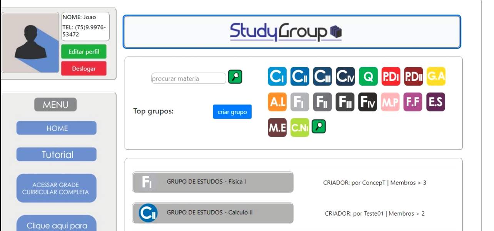
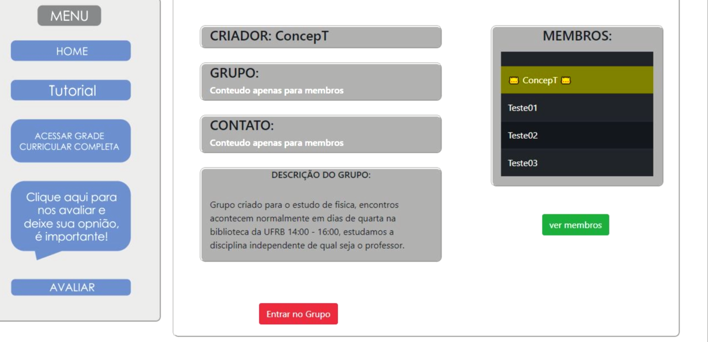

<html>
<body>

    

        

            
        

        

            
A platform designed to stimulate the creation of study groups for college subjects

        

        

            
        

        

            
Functions such as creating a study group for one or more subjects, combining study locations, managing group members and others.

        

        

            
        

        

            
Personalize your group, add a link to the chat and interact with your friends

        

        

            
        

        

            
Colaboradores

            
<a style="text-decoration: none; color: #161616;" href="https://github.com/S4nt1ag0" target="_blank">Gustavo Santiago</a>

            
<a style="text-decoration: none; color: #161616;" href="https://instagram.com/designer_ronaldcrv?igshid=1uir1yy2ynyi0" target="_blank">Ronald C.</a>

        

    

</body>
</html>